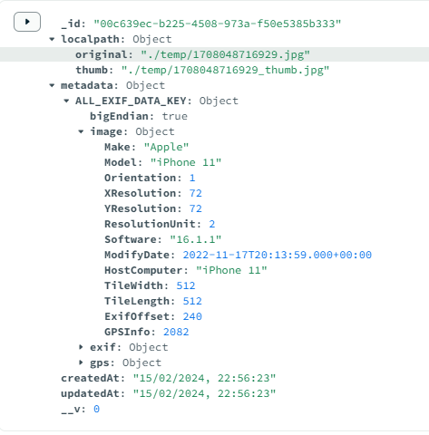

# Desafio Back-end Developer

## Objetivo

Desenvolver uma API Rest com um único end-point utilizando o framework NestJS e MongoDB. Realizar a tarefa como descrito a seguir

## Descrição do recurso

O end-point deve receber uma url pública de uma imagem JPG, JPEG ou PNG, deve salvar essa imagem no sistema de arquivos e gerar uma versão reduzida da imagem (acrescentando o sufixo \_thumb ao nome do arquivo), que deve ter sua maior dimensão com 720px e a dimensão menor proporcional. Caso a maior dimensão seja inferior a 720px, apenas uma cópia da imagem original deve ser feita com o sufixo no nome do arquivo.

A imagem reduzida deve ter compactação e o fator deve ser enviado como parâmentro junto com a url da imagem original.

O serviço deve também registrar numa instância do mongodb, todos os metadados contidos no [EXIF](https://tecnoblog.net/responde/o-que-sao-dados-exif-de-fotos-e-como-encontra-los-ou-esconde-los/). da imagem da imagem original.

# Resolução

## Pré-requisitos

Certifique-se de ter os seguintes pré-requisitos instalados em sua máquina:

- Docker: [Instalação do Docker](https://docs.docker.com/get-docker/)
- Docker Compose: [Instalação do Docker Compose](https://docs.docker.com/compose/install/)
- MongoDB Compass (GUI) [Opcional]: [Instalação do MongoDB Compass (GUI)](https://www.mongodb.com/try/download/compass)

## Como executar

Siga as etapas abaixo para executar a API Node.js:

1. Clone este repositório para sua máquina:

```shell
git clone git@github.com:Guilheeeerme/trakto.git
```

2. Navegue até o diretório do projeto:

```shell
cd trakto/
```

3. Renomeie o arquivo `.env.example` para `.env` e preencha o valor da variável `API_PORT` para definir em qual porta sua API irá executar.

4. Execute o seguinte comando para construir as imagens e iniciar os contêineres:

```shell
docker-compose up -d
```

5. Aguarde até que os contêineres sejam iniciados e a API esteja pronta para uso.

6. Faça uma requisição POST no endpoint `http://localhost:<PORTA>/image/save`, onde `<PORTA>` é a porta configurada no arquivo `.env`, com o modelo de body abaixo:

```json {
{
  "image": "https://files.tecnoblog.net/wp-content/uploads/2018/09/o-que-e-exif-002-1060x596.png",
  "compress": 80
}
```

Ou com a URL de uma imagem que contém Exif por exemplo:

```json {
{
  "image": "https://assets.storage.trakto.io/AkpvCuxXGMf3npYXajyEZ8A2APn2/0e406885-9d03-4c72-bd92-c6411fbe5c49.jpeg",
  "compress": 80
}
```

_O campo `image` deve receber uma string com uma url pública de uma imagem JPG_.  
_O campo `compress` deve receber um valor do tipo number entre 0.0 e 100_.

O response da requisição terá o seguinte modelo em caso de sucesso:

```json {
{
  "localpath": {
    "original": "example.jpg",
    "thumb": "example_thumb.jpg"
  },
  "metadata": {
    "ALL_EXIF_DATA_KEY": {}
  }
}
```

A imagem original e a thumb estarão na pasta `temp` na raíz do projeto.

Em caso de erro na requisição, o response terá o seguinte modelo:

```json
{
  "errors": [
    {
      "code": 400,
      "message": "error message"
    }
  ]
}
```

8. Você pode conectar no MongoDB Compass com a seguinte uri: `mongodb://localhost:27017`, e ver as informações do exif da imagem original, no documento que foi inserido no banco de dados. Exemplo:



## Como parar

Para parar e remover os contêineres da API, execute o seguinte comando no diretório do projeto:

```shell
docker-compose down
```

Isso encerrará os contêineres e liberará os recursos utilizados.
